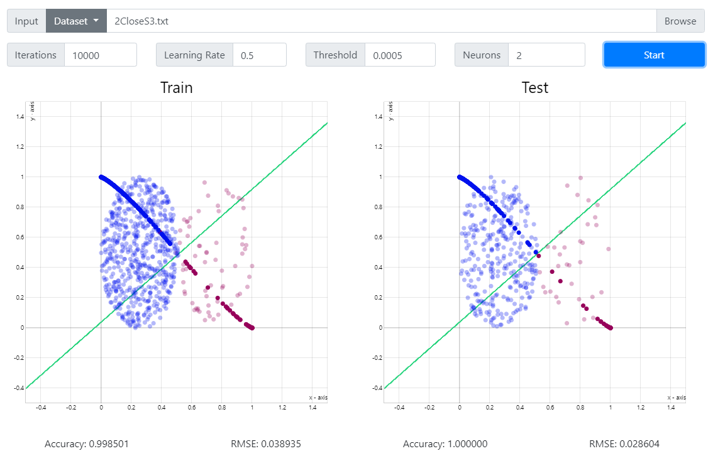
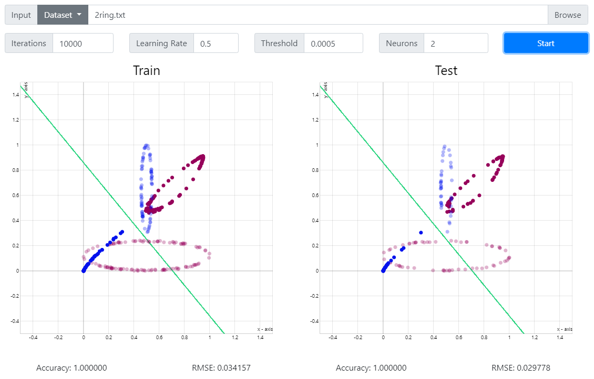

# 多層感知機
中央大學 CE5037 類神經網路 作業二

實作多層感知機

# 功能
本程式能以輸入資料集對多層感知機進行訓練並輸出分類結果。
# 使用方法
1. 選擇資料集: 可以下拉選單選擇預置資料集，或直接選擇檔案。
2. 設定訓練次數、學習率、收斂條件及隱藏層神經元數量。
3. 按下Start按鈕即開始訓練並顯示結果。
4. 滑動下方滑條可觀察訓練過程。
## 快捷鍵
+ F5: 重新整理
+ F12: 開發工具
# 資料集
本程式能夠處理3維以上輸入資料。
本程式在資料數量為四以上時會隨機將資料中的2/3作為訓練資料1/3做為測試資料。
# 多層感知機
本程式多層感知機隱藏層層數為一，預設隱藏層神經元個數為二。
# 訓練
本程式預設學習率為0.5，收斂條件為均方誤差，預設為0.0005，最大迭代次數預設為10000次，初始鍵結值為-1到1之間的隨機數。
# 輸出
本程式輸出結果包含2d圖像、訓練及測試辨識率、RMSE及鍵結值(頁面下方)。2d圖像包含原資料座標點(淺色)、轉換後的資料點及函數線段。
若輸入資料維度不為2則不會輸出圖像。
若MLP隱藏層神經元數不為2或資料類別數大於2則輸出圖像僅包含原資料點。
在開發工具的console中會輸出資料集、鍵結值，以及訓練過程的MSE等資訊。
# 數字模式
若輸入資料集名稱為Number.txt，則在按下Start進行訓練後可再選擇以字串或檔案輸入測試資料進行測試。
訓練及測試結果將輸出數字圖像、資料編號、目標分類及預測分類。
點擊數字圖像兩側可以切換資料輸出結果。

# 建置
1. 部署 Nodejs 環境。
2. 在程式碼目錄下執行指令「npm install」。
3. 以「npm start」指令開始執行程式。
4. 以「npm run dist」指令產生執行檔於dist目錄下。

# 實驗結果
+ 2CloseS 資料集

  
+ 2CloseS2 資料集
  
  
+ 2CloseS3 資料集
  
  
+ 2cring 資料集
  
  
+ 2CS 資料集
  
  
+ 2Hcircle1 資料集
  
  
+ 2ring 資料集
  
  
+ 5CloseS1 資料集
  
  